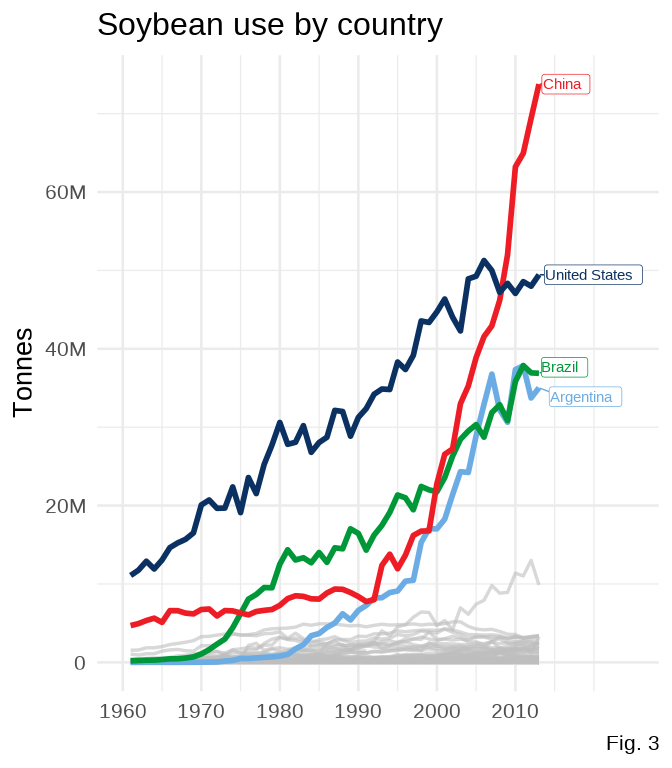
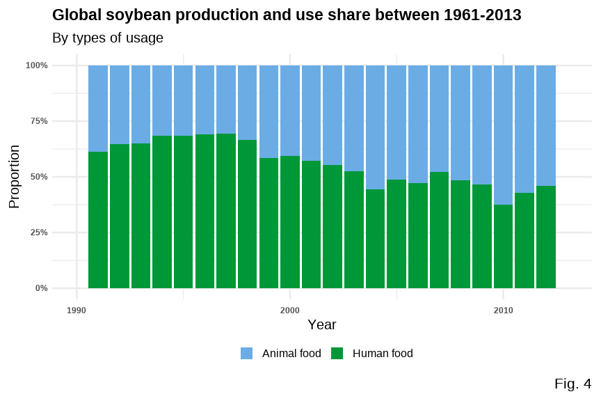

Is soybean use driving global deforestation?
================
by Team 5 Look Alive

``` r
library(tidyverse)
library(tidymodels)
library(palmerpenguins)
library(knitr)
library(xaringanthemer)
library(ggdark)
library(scales)
library(viridis)
library(gghighlight)
knitr::opts_chunk$set(echo = T)
```

## Introduction

Our data comes originally from the UN Food and Agriculture
Organization’s Forest Resources Assessment. “Since year-to-year changes
in forest cover can be volatile, the UN FAO provide this annual data
averaged over five-year periods.” It measures the area of forests over
time in countries around the world. It also holds more detailed
information about the loss of Brazilian forest over time. The data
further holds data about soybean production and vegetable oil production
by year and country.

The dataset has 5 elements: `forest`, `forest_area`, `brazil_loss`,
`soybean_use`, and `vegetable_oil`. The set `forest` contains the change
every 5 years in for forest area in conversion. `forest_area` contains
the change in global forest area as a percent of global forest area.
`brazil_loss` contains the loss of Brazilian forest due to specific
types of deforestation, such as `fire` and `small_scale_clearing`.
`soybean_use` contains the soybean production and use by year and by
country. Finally, the set `vegetable_oil` contains vegetable oil
production by crop type and year.

## What countries are seeing the most deforestation within their borders, and what is causing this deforestation?

### Introduction

These ideas stuck us as the most essential elements of deforestation,
and gaining an understanding of the complexities of deforestation
depends on becoming familiar with these concepts.

### Approach

In this question, we planned on exploring three things: the who, the
what, and the why of deforestation. First, we chose to use a line plot
to examine trends over time in deforestation. This would allow us to get
a rough understanding of how many countries are facing the most
deforestation and examine the most deforested country’s data, using a
cumulative line plot of deforestation and a bar plot to compare across
years. From here, we could then examine the “what”. To do this, we
decided to compare the proportions with an area plot. This gave us the
opportunity to showcase which causes are the most impactful in Brazil’s
deforestation. Finally, to understand the “why” of deforestation, we
selected to examine one of the leading causes of deforestation in
Brazil. Using line plots again allowed us to highlight which regions and
countries are most influential in driving soybean production globally.

Putting all of these factors together gives us a basic understanding of
global deforestation.

### Analysis

#### Figure 1

``` r
# set default theme for ggplot2
ggplot2::theme_set(ggplot2::theme_minimal(base_size = 16))

# For better figure resolution
knitr::opts_chunk$set(
  fig.retina = 3, 
  dpi = 300, 
  fig.width = 6, 
  fig.asp = 0.618, 
  out.width = "70%"
  )

# these relabel col 1 but we don't care bc it's meaningless
forest <- read_csv("data/forest.csv")
forest_area <- read_csv("data/forest_area.csv")
brazil_loss <- read_csv("data/brazil_loss.csv")
vegetable_oil <- read_csv("data/vegetable_oil.csv")
soybean_use <- read_csv("data/soybean_use.csv")

brazil_loss <- brazil_loss %>%
  rowwise() %>%
  mutate(total_brazil_forest_loss_hectares = sum(c_across(commercial_crops:small_scale_clearing))) %>%
  ungroup()


annotation <- tibble(
   x = c(2010),
   y = c(-7300000),
   label = c("Brazil has lost")
)
annotation2 <- tibble(
   x = c(2010),
   y = c(-10500000),
   label = c("over 30 million")
)
annotation3 <- tibble(
   x = c(2010),
   y = c(-15700000),
   label = c("hectares of forest\nsince 2000")
)

brazil_loss <- brazil_loss %>%
  select(year, total_brazil_forest_loss_hectares) %>%
  add_row(year = 2000, total_brazil_forest_loss_hectares = 0, .before = 1) %>%
  mutate(cum_sum = -(cumsum(total_brazil_forest_loss_hectares)))

ggplot(brazil_loss) +
  geom_line(aes(year, cum_sum), size = 2, color = "#009739") +
  geom_bar(aes(year, -total_brazil_forest_loss_hectares), stat="identity") +
  geom_hline(aes(yintercept = 0), color = "red", size = 1.5) +
  labs(title = "Cumulative Brazilian forest loss", subtitle = "2000 to 2013", x = NULL, y = "Hectares") +
  scale_y_continuous(labels = label_number_si()) +
  scale_x_continuous() +
  geom_text(data=annotation, aes(x=x, y=y, label=label),
           color="black", 
           size=6, angle=0) +
  geom_text(data=annotation2, aes(x=x, y=y, label=label),
           color="red", 
           size=7, angle=0, fontface="bold") +
  geom_text(data=annotation3, aes(x=x, y=y, label=label),
           color="black", 
           size=6, angle=0) +
  scale_x_continuous(breaks = seq(from = 2000, to = 2013, by = 4)) +
  theme(panel.grid.minor.x = element_blank())
```


#### Figure 2

``` r
brazil_loss_no_total <- read.csv("data/brazil_loss.csv") %>% select(-(1:3))
brazil_loss_no_total <- brazil_loss_no_total %>%
  pivot_longer(!year,
               names_to = "cause",
               values_to = "forest_lost") %>%
  mutate(cause = case_when(
    cause == "pasture" ~ "Pasture",
    cause == "fire" ~ "Fire",
    cause == "commercial_crops" ~ "Commercial Crops",
    cause == "selective_logging" ~ "Logging",
    cause == "small_scale_clearing" ~ "Small-Scale Farming",
    T ~ "Other"
  ) %>% 
  factor(levels=c('Fire', "Logging", "Small-Scale Farming", "Commercial Crops", 'Pasture',"Other"))) %>%
  group_by(cause, year) %>%
  summarise(sum = sum(forest_lost), .groups = 'drop') %>%
  group_by(year, cause) %>%
  summarise(n = sum(sum)) %>%
  mutate(percentage = n / sum(n))

ggplot(brazil_loss_no_total, aes(year, percentage, fill=cause)) + 
    geom_area(alpha = 0.9) +
  scale_fill_manual(values = c("#E69F00", "#56B4E9", "#CC79A7", "red", "#0072B2", "#D55E00")) +
  scale_y_continuous(labels = scales::percent) +
  labs(x = NULL, y = NULL, title = "Causes of loss of forest in Brazil", fill = NULL,
       caption = "Fig. 2") +
  scale_x_continuous(breaks = seq(from = 2000, to = 2013, by = 4)) +
  theme(legend.position = "bottom")
```


#### Figure 3

``` r
soy_use_by_country <- soybean_use %>%
  filter(!is.na(code),
         entity != "World") %>%
  rowwise() %>%
  mutate(total = sum(human_food, animal_feed, processed, na.rm = T))

# https://stackoverflow.com/questions/49438953/selective-labeling-for-ggplot-lines
# https://cran.r-project.org/web/packages/gghighlight/vignettes/gghighlight.html

soy_use_by_country %>%
  ggplot(aes(x = year, y = total, color = entity)) +
  geom_line(show.legend = F, size = 2) +
  gghighlight(max(total), max_highlight = 4,
              unhighlighted_params = list(size = 1.2, colour =
                                            alpha("gray", 0.6))) +
  scale_y_continuous(labels = label_number_si()) +
  labs(y = "Tonnes", x = NULL, title = "Soybean use by country",
       caption = "Fig. 3") +
  # flagcolorcodes.com
  scale_color_manual(values = c("#6CACE4", "#009739", "#EE1C25", "#0A3161")) +
  scale_x_continuous(breaks = seq(from = 1960, to = 2013, by = 10))
```



### Discussion

Figure 1 portrays the amount of lost forest in Brazil in the span of 13
years, from 2000 to 2013. The loss is striking at over 30 million
hectares (300,000 square km, for reference). The figure does show a
concave trend, which shows that the loss of forest is not exponential,
signaling that there may be hope in a continued flattening of this line
of forest loss. It is interesting to consider what factors may have
contributed to these trends within Brazil. Lawmaking and leadership will
play a role in a country’s development, meaning that it would be
fascinating to gather this same data from Jair Bolsonaro’s current reign
as Brazil’s president and compare it to the trends under Brazilian
presidents who led during the time period of this plot, such as Lula de
Silva, who served as president from 2003-2010 in Brazil (Wikipedia,
Brazilian Presidents).

Figure 2 offers a view of the causes of Brazilian loss of forest. The
most common reason for removal of forest in Brazil is to clear space for
land to be used as pasture. Other big causes of loss of forest include
fire, logging, small-scale farming, and commercial crops. Fires
fluctuate wildly on the plot, demonstrating their lack of predictability
and their destructive nature. Global warming and human activity may be
factors that contributes to the increased danger of forest fires in the
Amazon (Bush et. al. 2008). One important commercial crop is soybean,
which we chose to analyze further, guided by our retrieval of data on
soybean use.

Figure 3 gives a look into which countries are the largest consumers of
soybean, which in turn increases demand for soybean and drives
deforestation. China, the United States, Brazil, and Argentina were
found to be the most prevalent soybean consumers. Argentina was the most
surprising to us, but we found that soybean is a vital crop to
Argentina, which incentivizes the use of soybean after its growth
(croplife, Soybeans in Argentina).

## How does the proportions of soybean production used for human food versus for feeding animal change over time? Is this change in proportions related to global deforestation?

### Introduction

In the second question, we wanted to start understanding the patterns of
soybean use over time. After gaining and understanding of how total
soybean use and production have drastically increased around the world
in the last 50 years, we looked in question 2 at the specific ways
soybean is used within an overall increasing trend and how that relates
to deforestation globally.

### Approach

We started by looking at the proportion of soybeans used for animal feed
as compared to human food, over time. We followed this by looking at
trends in global forest conservation, and compared these two plots to
see if our understanding of deforestation causes matched with the trend
in changing patterns of soybean use.

### Analysis

#### Figure 1

``` r
data2 <-soybean_use %>%
  group_by(year) %>%
  summarise(total_human = sum(human_food, na.rm = T),
            total_animal = sum(animal_feed, na.rm = T)) %>%
  pivot_longer(!year, 
              names_to = "use",
              values_to = "amount") 

data2 <- data2 %>%
   group_by(year) %>%
   mutate(prop = amount / sum(amount))
 
data2 %>%
  filter(year >= 1977) %>%
  ggplot(aes(fill = use, y = prop, x = year)) + 
  geom_bar(position ="fill", stat ="identity") +
  
  scale_x_continuous (name = "Year",
                      limits = c(1990, 2013),
                     breaks = seq(from = 1990, to = 2013, by = 10)) +
  scale_y_continuous(name = "Proportion",
                     labels = c("0%", "25%", "50%","75%","100%")) +
  scale_fill_manual(values = c("orangered4", "goldenrod1"), 
                    name = NULL, labels = c("Animal food", "Human food")) +
  
  labs(title = "Global soybean production and use share between 1961-2013",
       subtitle = "By types of usage") +
  
  theme(plot.title = element_text(face = 'bold',size = 13),
        plot.subtitle = element_text( size = 12),
        legend.position = "bottom",
        legend.key.size = unit(.5, "cm"),
        legend.text = element_text(size = 10),
        legend.box.spacing = unit(0.2, "cm"),
        axis.title.x = element_text(size = 10),
        axis.title.y = element_text(size = 10),
        axis.text.x = element_text( size = 7,face = "bold"),
        axis.text.y = element_text(margin = margin(t = .3, unit = "cm"), size = 7, face = "bold"))
```



#### Figure 2

``` r
forest2 <- forest %>%
  filter(entity == "World")

ggplot(forest2,aes(x=year, y = net_forest_conversion, fill=year)) + 
  geom_area(aes(color = entity), size = 2.5, fill= "lightgray", alpha = 0.5) +
  scale_color_manual(values = c("burlywood4")) +
  scale_y_continuous(labels = label_number_si()) +
  scale_x_continuous(limits = c(1990, 2013),
                     breaks = seq(from = 1990, to = 2013, by = 10)) +

  
  labs(title = "Global Net Forest Conversion (hectares)", x = "Year", y = NULL) +
  
  theme(legend.position = "none",
        plot.title = element_text(face = 'bold',size = 17),
        axis.title.x = element_text(size = 16),
        axis.text.x = element_text( size = 13,face = "bold"),
        axis.text.y = element_text(margin = margin(t = .3, unit = "cm"), size = 13, face = "bold"))
```


### Discussion

Figure 1 portrays the changing proportion of how much soybean is used
for animal feed versus human food each year 1961-2013. We can see a
relatively clear trend of an increase in animal/human food use. What we
had observed is that the proportion of soybean use for animal feed
(mostly used for feeding poultry, hogs, cattle and dairy production )
drastically increased, from less than 10% share in 1961 to more than 50%
share in 2013; while the proportion of soybean use for human food (like
salad oil, tofu, or tempeh) had decreased accordingly. Soybean meal is a
highly palatable form of protein, and is often used as the dominant
source of protein for most types farm animals, including pigs, cattle,
poultry and aquaculture (Soybean Meal). Knowing this, it was not
surprising to see that animal use has increased, as we know that humans
as a species are eating more meat.

Figure 2 shows the global net forest conversion in hectares (1000 sq m).
Net Forest conversion is the clearing of natural forests to use the land
for another purpose. Since the net forest conversion are all negative
(not positive), from 1990 till 2015, it means that more natural land
continues to be used for other purposes, just at a slowing rate. A
slowed rate of deforestation is a good thing, but it is not the same as
afforestation (turning cleared land back into natural forest).

We might speculate that the increasing proportion of soybean used for
animal feed indicates a relationship with increased livestock rearing.
Livestock require land, so seeing a continued rate of deforestation with
large proportions of soybean use being for livestock makes sense to us.
We also see, in the soybean use trend, happening in the late 1990s and
early 2000s, with the proportion somewhat evening out in recent years.
This matches what we see in global deforestation trends as the rate of
global deforestation has slowed.

Overall, we have seen that increased global use of soybeans is related
with continued deforestation in Brazil, the world’s leading soybean
producer (surpassing USA as of May 2021). And an increased proportion of
soybeans used for animal feed (vs. those used for human food) is related
with continued land conversion (natural land –&gt; human used), albeit
at a slower rate.

## Presentation

Our presentation can be found [here](presentation/presentation.html).

## Data

Ritchie, H. and Roser, M. 2021, “Forests and Deforestation”. Published
online at OurWorldInData.org. Retrieved from:
‘<https://ourworldindata.org/forests-and-deforestation>’ on September
13, 2021 \[Online Resource\]

## References

1.  [Brazilian
    Presidents](https://en.wikipedia.org/wiki/List_of_presidents_of_Brazil)
2.  Bush, M. B., Silman, M. R., McMichael, C., & Saatchi, S. (2008).
    Fire, climate change and biodiversity in Amazonia: a Late-Holocene
    perspective. Philosophical transactions of the Royal Society of
    London. Series B, Biological sciences, 363(1498), 1795–1802.
    <https://doi.org/10.1098/rstb.2007.0014>
3.  [Soybeans in
    Argentina](https://croplife.org/news-views/sharing-the-story/soybeans-from-argentina/#:~:text=The%20country%20grew%2020%20million,cereal%2C%20automotive%20and%20petrochemical%20exports.&text=The%20health%20of%20the%20soybean,therefore%2C%20of%20great%20national%20interest.)
4.  [Our World in
    Data](https://ourworldindata.org/forests-and-deforestation)
5.  [Deforestation](https://ourworldindata.org/deforestation)  
6.  [Share of forest area](https://ourworldindata.org/forest-area)  
7.  [Drivers of
    deforestation](https://ourworldindata.org/drivers-of-deforestation)  
8.  [Deforestation by
    commodity](https://ourworldindata.org/grapher/deforestation-by-commodity)  
9.  [Soybean production and use](https://ourworldindata.org/soy)  
10. [Palm oil production](https://ourworldindata.org/palm-oil) 10.[Net
    Forest
    Conversion](https://www.clientearth.org/latest/latest-updates/stories/what-is-forest-conversion/)
11. [Soybean
    meal](https://urldefense.com/v3/__http://www.nordfeed.com/soybean-meal.html__;!!OToaGQ!6GnIygzAAWSux7dLuDZLpqhNCKurCM7RmXqN4v3G6ZO98IqaT7ipBS9fBz2YqZfUEg$)
